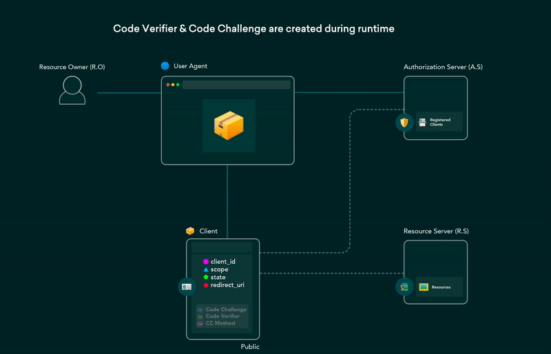

# DotNetExtensions.OAuth20.Server - Core OAuth 2.0 Authorization Libraries

<!-- [](https://github.com/DotNetExtensions/OAuth20.Server/actions/workflows/build.yml) -->
<!-- [](https://www.nuget.org/packages/DotNetExtensions.OAuth20.Server) -->
[](./LICENSE)
[](https://github.com/DotNetExtensions/OAuth20.Server/graphs/contributors)

DotNetExtensions.OAuth20.Server is a modular, cross-platform solution designed to implement OAuth 2.0 authorization flows in .NET applications. This project offers reusable libraries for core OAuth 2.0 functionalities and Blazor-based UI components, making it easy to integrate secure authorization services into your .NET projects.



*Figure 1: OAuth 2.0 [Protocol Flow](https://datatracker.ietf.org/doc/html/rfc6749#section-1.2) (taken from [dev.to article (authored by "Hem")](https://dev.to/hem/oauth-2-0-flows-explained-in-gifs-2o7a))*

## Table of Contents

- [Project Overview](#project-overview)
- [Key Features](#key-features)
- [Getting Started](#getting-started)
- [Installation](#installation)
  - [Using NuGet Packages](#using-nuget-packages)
  - [Direct Download](#direct-download)
  - [Adding Services and Middleware](#adding-services-and-middleware)
- [Running Tests and Benchmarks](#running-tests-and-benchmarks)
- [Demo Projects](#demo-projects)
- [Project Structure](#project-structure)
- [Development Workflow](#development-workflow)
- [Roadmap](#roadmap)
- [Task List](#task-list)
- [Community and Support](#community-and-support)
- [Contributing](#contributing)
- [Security](#security)
- [Change Log](#change-log)
- [License](#license)
- [References](#references)

## Project Overview

Welcome to the DotNetExtensions.OAuth20.Server project, a comprehensive solution for implementing OAuth 2.0 authorization flows in .NET applications. This repository contains the core OAuth 2.0 authorization libraries, data source integration libraries, and Blazor-based UI components (Admin Panel and Personal Account). These components are distributed via NuGet packages for easy integration into your .NET projects.

## Key Features

- **Modular Architecture:** Provides core functionality through reusable libraries, allowing for flexible integration into existing applications.
- **Cross-Platform Compatibility:** Supports .NET 8, .NET Standard 2.0/2.1, and .NET Framework 4.8.1.
- **Flexible Data Storage:** Supports in-memory, SQLite, MS SQL Server, PostgreSQL, MySQL, and more.
- **User Interfaces:** Includes Blazor-based user-friendly Admin Panel and Personal Account UI for managing OAuth 2.0 consents and configurations.
- **Security Compliance:** Adheres to the OAuth 2.0 [RFC 6749](https://datatracker.ietf.org/doc/html/rfc6749) specification with additional enhancements.
- **CI/CD Integration:** Automated workflows using GitHub Actions for building, testing, and release uploading.
- **Comprehensive Testing:** Includes unit, integration, and load tests, benchmarks, demo projects, and configuration samples.

## Getting Started

To get started with DotNetExtensions.OAuth20.Server, follow the installation instructions below to integrate the library into your project.

## Installation

**Prerequisites:**

- .NET SDK (version 8.0 or later)

### Using NuGet Packages

The libraries are available as NuGet packages. To install, use the following command in your package manager console:

```bash
dotnet add package DotNetExtensions.OAuth20.Server --version x.x.x
```

Replace `x.x.x` with the latest version number from the [NuGet Gallery](https://www.nuget.org/packages/DotNetExtensions.OAuth20.Server).

### Direct Download

You can also download the compiled library assemblies directly from the [GitHub Releases](https://github.com/DotNetExtensions/OAuth20.Server/releases) page and add them to your project manually.

### Adding Services and Middleware

Add the library services in your `Startup.cs` or `Program.cs` file:

```csharp
services.AddOAuth20Server();
```

And use its middleware:

```csharp
app.UseOAuth20Server();
```

## Running Tests and Benchmarks

To run the unit tests included in the repository, use the following command:

```bash
dotnet test
```

To run benchmarks, navigate to the benchmarks directory and use:

```bash
dotnet run -c Release
```

## Demo Projects

This project includes several demo projects within the repository to help you get started with different OAuth 2.0 flows. You can find these in the `Demos` directory. Follow the README files within each demo project for setup and usage instructions.

## Project Structure

This project is part of the following repositories:

- **Project Repository:** [DotNetExtensions/OAuth20](https://github.com/DotNetExtensions/OAuth20)
  - Essential Project Documentation

- **Library Repository:** [DotNetExtensions/OAuth20.Server](https://github.com/DotNetExtensions/OAuth20.Server) (Current Repository)
  - Core Libraries
  - Data Source Libraries
  - UI Libraries
  - Infrastructure (tests, benchmarks, demos)
  - Available via NuGet and direct download.

- **Hosted Application Repository:** [DotNetExtensions/OAuth20.Server.Host](https://github.com/DotNetExtensions/OAuth20.Server.Host)
  - ASP.NET Core Application
  - Integration with core and UI libraries
  - Infrastructure (tests, demos)
  - Deployment support via Docker, Kubernetes, Helm, Windows Service, IIS.

## Development Workflow

We follow the GitFlow branching strategy for managing our development and release processes. For detailed information, please refer to our [GitFlow Guide](https://github.com/DotNetExtensions/OAuth20/blob/main/GITFLOW.md).

## Roadmap

To understand our future plans and milestones, please refer to our [Roadmap](https://github.com/DotNetExtensions/OAuth20/blob/main/ROADMAP.md).

## Task List

For a detailed breakdown of ongoing and upcoming tasks, please refer to our [Task List](https://github.com/DotNetExtensions/OAuth20/blob/main/TASKLIST.md).

## Community and Support

For discussions, support, and feedback, please visit:

- [GitHub Project Page](https://github.com/orgs/DotNetExtensions/projects/17)
- [Project Website](https://dotnetextensions.com/oauth20)
- [Community Board](https://dotnetextensions.com/oauth20/community)
- [Support Page](https://dotnetextensions.com/oauth20/support)

## Contributing

We welcome contributions! Please read our [Contributing Guidelines](./CONTRIBUTING.md) to get started.

For detailed information on coding, formatting, and contribution conventions, please refer to our [Conventions](https://github.com/DotNetExtensions/OAuth20/blob/main/CONVENTIONS.md) file.

Please note that all contributions are expected to adhere to our [Code of Conduct](./CODE_OF_CONDUCT.md).

## Security

We take the security of our project seriously. If you discover any security vulnerabilities, please report them by following the instructions in our [Security Policy](./SECURITY.md).

## Change Log

All notable changes to this project are documented in our [CHANGELOG.md](./CHANGELOG.md).

## License

This project is licensed under the [MIT License](./LICENSE).

## References

This project is based on the OAuth 2.0 Authorization Framework, specifically following the guidelines set forth in [RFC 6749](https://datatracker.ietf.org/doc/html/rfc6749).
